[](https://www.repostatus.org/#active)
[](https://github.com/antoniojbt/episcout/actions/workflows/r-cmd-check.yml)
[](https://app.codecov.io/gh/AntonioJBT/episcout)

# episcout

episcout provides lower-level helper functions and specification-first workflows for cleaning, exploring and visualising epidemiological data. Use a declared data dictionary to make schema checks, missingness summaries, descriptive summaries, plots and optional reports repeatable.

## Install

Install the published 0.4.1 release from GitHub:

```r
install.packages("devtools")
devtools::install_github("AntonioJBT/episcout@0.4.1")
```

The immutable 0.4.1 tag retains `Version: 0.4.0` in its `DESCRIPTION`. Published history is preserved; current `master` uses development version `0.4.1.9000`.

Install from `master` only when you deliberately need the current development version:

```r
devtools::install_github("AntonioJBT/episcout")
```

## Choose a workflow

- **Lower-level cleaning, statistics and plotting helpers:** begin with the [lower-level helper introduction](vignettes/introduction_episcout.Rmd). It contains a runnable neutral synthetic-data example.
- **New-data specification-first exploratory data analysis workflows:** start with `epi_eda_intake_run()` for a guided intake, or compose `epi_eda_run()` and `epi_eda_render_report()` from the [specification-first EDA guide](vignettes/specification-first-eda.Rmd). Create and review a semantic dictionary before running schema checks, summaries, plots or reports. Synthetic data support pipeline preparation and testing; they are not suitable for inference. episcout creates the requested outputs but does not decide whether they may be shared.
- **Longitudinal PostgreSQL pseudonymisation:** follow the [longitudinal pseudonymisation guide](vignettes/longitudinal-pseudonymisation.Rmd) before handling restricted data. Pseudonymised data remain restricted personal data; they are not anonymous or automatically disclosure-controlled.
- **Probabilistic record linkage:** use the [probabilistic linkage guide](vignettes/probabilistic-record-linkage.Rmd) only when exact linkage is unavailable and the project can supply and independently validate its own model and thresholds. Model decisions remain sensitive evidence; episcout does not verify identities, resolve review pairs or write a crosswalk or registry.
- **Explicit geospatial mapping:** follow the [geospatial mapping guide](vignettes/geospatial-mapping-primer.Rmd) to declare coordinates and CRS, inspect geometry and create maps. Bounds and feature maps are value-bearing and may disclose location.

For an end-to-end learning example that combines disposable PostgreSQL tables, pseudonymisation and aggregate EDA delivery, use the [database-to-EDA-delivery walkthrough](inst/examples/db-to-report/README.md). Its synthetic data are for learning and testing, not inference; aggregate output is not automatically disclosure-controlled.

## Generic analytical pipeline contract

The following is the reference sequence for projects that compose episcout with an ingestion layer such as Epidepot. It is a design contract rather than a claim that every box already has a dedicated public function; implementation work is tracked in [#340](https://github.com/AntonioJBT/episcout/issues/340).

```mermaid
flowchart TD
    A["Source delivery"] --> B["Source-wide ingestion + raw retention<br/>(external ingestion layer, e.g. Epidepot)"]
    B --> C["Project selects analytical relation<br/>(selection may remain unset until analysis)"]
    C --> D["Technical typing / schema contract"]

    D --> E["Identifier QC<br/>missing/blank · counts/distinct · whitespace · length<br/>format/pattern · duplicates/conflicts"]
    E --> F["Optional project-approved derivations from identifiers<br/>before source identifiers are removed"]
    F --> G["Identity resolution + pseudonymisation"]

    subgraph T["Transversal / single-period analytical contract"]
        G --> H["First-pass QC"]
        H --> I["QC report"]
        I --> J["Specification-driven cleaning<br/>+ dictionary/catalogue application"]
        J --> K["Transversal EDA"]
        K --> L["Transversal EDA report"]
    end

    L --> M["Completed curated period"]
    M --> N["Accumulate completed periods"]

    subgraph LONG["Longitudinal analytical contract"]
        N --> O["Construct longitudinal dataset"]
        O --> P["Longitudinal first-pass QC"]
        P --> Q["Longitudinal QC report"]
        Q --> R["Longitudinal cleaning<br/>+ dictionary/catalogue application"]
        R --> S["Longitudinal EDA"]
        S --> U["Longitudinal EDA report"]
    end
```



Identifier QC is deliberately separate from identity resolution and pseudonymisation. Identifiers are normally treated as text unless the caller declares another technical contract; the first pass should at least assess missing and blank values, row/distinct counts, duplicate frequency, leading/trailing or unusual whitespace, observed and expected lengths, and optional exact pattern or character-class violations. QC should report evidence rather than silently normalise identifiers.

If a structured identifier contains analytically useful components, a project may declare deterministic derivations before pseudonymisation removes the source identifier from the analytical relation. Derived dates, geography and similar fields can remain quasi-identifiers and are not automatically anonymous or safe to disclose.

The period-level QC report is distinct from the later EDA report: it documents the observed state before reviewed cleaning and dictionary/catalogue decisions are applied. A completed curated period is a first-class output. Longitudinal work consumes completed periods and repeats the same QC → reviewed cleaning/dictionaries → EDA/report pattern on the constructed longitudinal dataset.

`epi_eda_longitudinal_qc()` implements the aggregate population-membership and optional record-key part of longitudinal first-pass QC for explicitly ordered completed PostgreSQL periods. It reports period populations, adjacent retention/exit/entry, every pairwise overlap, aggregate first/last/period-count/gap histories and four technical warning types without returning entity or key values. It does not construct a row-level longitudinal dataset, resolve identity, pseudonymise, clean data, inspect variable drift or make a scientific judgement about observed population change.

`epi_eda_longitudinal_drift()` complements that population evidence with descriptive, aggregate-only continuity evidence for reviewed variables across the same kind of ordered PostgreSQL periods. It reports schema compatibility and missingness for every selected field, and canonical numeric, categorical or temporal summaries where their declared analysis type supports them. It is descriptive evidence only: it does not set thresholds, classify change as problematic, clean data, alter a dictionary or make scientific interpretations. The default `max_levels = 50L` is a hard categorical-domain limit, applied to declared levels, each period and each adjacent union; an over-limit domain fails the call rather than being truncated. Source rows and identifiers remain in PostgreSQL, and the operation returns no partial object if validation or aggregation fails.

`epi_eda_longitudinal_transitions()` is the separate retained-entity view for explicitly selected categorical or binary variables. It compares adjacent periods only, classifies each distinct valid entity-period as missing, usable or conflicting, and reports a complete bounded state-to-state matrix for entities with one usable state on both sides. Conflict takes precedence over missingness for exclusions; zero eligible denominators retain declared zero cells with unavailable proportions. V1 accepts at most 50 states and therefore emits no more than 2,500 cells per variable and adjacent pair. The function does not treat entry or exit as a state, compare variables with each other, infer project-specific events or make scientific judgements.

`epi_eda_longitudinal()` is the additive descriptive layer for one already-curated long-form panel held in a data frame or one reviewed PostgreSQL relation. Explicit identifier and discrete-time columns anchor aggregate panel structure, follow-up, declared time-point presence and retention, entity-time variable completeness, unchanged canonical time-stratified summaries, and signed numeric change. Missing, usable and conflicting entity-time cells remain explicit; only six value-free technical warning codes are emitted. The function does not replace population QC, marginal drift or categorical transitions, and it does not clean, impute, balance or interpret the panel.

## Features

- `epi_clean_*`, `epi_stats_*`, `epi_plot_*` and `epi_utils_*` provide lower-level helpers for data preparation, descriptive work, plotting and utilities.
- `epi_eda_*` provides specification-first EDA for in-memory data and supported PostgreSQL sources. Specifications use separate `database_type` storage families and `analysis_type` EDA treatments. Optional `plot_style` callbacks receive a completed plot and compact plot metadata, then return one plot; database bundles also require a non-secret `plot_style_id` so styled output has explicit provenance.
- `epi_eda_profile_stratified()` and opt-in `epi_eda_db_run(strata = ...)` produce PostgreSQL-native grouped aggregates and Table 1 without collecting analysis rows; Shapiro-Wilk is unavailable on this path because it requires an analysis-value vector.
- `epi_eda_qc_proposals()` links aggregate descriptive evidence to explicitly pending review prompts through caller-managed opaque variable keys; it never changes the reviewed dictionary or data and never approves or applies a cleaning rule.
- `epi_eda_cleaning_rules()` and `epi_eda_apply_cleaning_rules()` validate a neutral six-field technical rule schema and apply bounds, allowed values and missing codes to a complete new data-frame, CSV, RDS or PostgreSQL output without replacing the source or an existing destination.
- `epi_eda_approved_civil_dates()` and `epi_eda_derive_civil_dates()` require an explicit reviewed civil-date declaration, preserve local timestamp sources and add separate dates only after every non-missing value passes exact-midnight validation; they never infer or assign a timezone.
- `epi_eda_longitudinal_qc()` compares aggregate entity membership and optional complete record-key uniqueness across caller-ordered PostgreSQL periods in one read-only repeatable-read snapshot. Counts are exact through `2^53 - 1`, every proportion names its denominator, and zero denominators produce unavailable proportions.
- `epi_eda_longitudinal_drift()` compares reviewed variable schema, missingness and supported descriptive distributions across caller-ordered PostgreSQL periods in one read-only repeatable-read snapshot. It uses the package's canonical PostgreSQL summary definitions, records unavailable evidence explicitly, and applies a fail-not-truncate categorical-domain bound.
- `epi_eda_longitudinal_transitions()` compares bounded categorical or binary states for retained distinct entities across adjacent caller-ordered PostgreSQL periods. Entity reconciliation and aggregation stay inside one read-only repeatable-read snapshot; missing and conflicting entity-period states are explicit exclusions rather than invented categories.
- `epi_eda_longitudinal()` describes one reviewed long-form panel while retaining declared zero-observation time points. PostgreSQL identifier grouping remains database-side and every custom count plus the unchanged canonical stratified summaries share one read-only repeatable-read snapshot.
- `epi_sec_*` provides auditable longitudinal pseudonymisation for related PostgreSQL tables. Recurring identities retain their pseudonymous identifiers only when later runs reuse the same persisted registry and compatible identity mapping; separate registries do not establish cross-run stability.
- `epi_linkage_*` provides declared in-memory normalisation, bounded candidate generation, field comparison, Fellegi--Sunter scoring, three-way classification and complete-truth validation. It supplies no model values or thresholds and performs no crosswalk or registry writes.
- `epi_geo_*` provides explicit vector and coordinate mapping with optional `sf` support.

## Contributing

Read [AGENTS.md](AGENTS.md) for development and contribution instructions, [PROJECT_MAP.md](PROJECT_MAP.md) for implemented workflows and package locations, and use the canonical checks in `scripts/check-local.sh` and `scripts/check-cran.sh`. SVG visual snapshots are regression evidence for rendering only: they do not independently validate plot labels, ordering, denominators, scales, input semantics or accessibility. Report defects or propose changes through the [issue tracker](https://github.com/AntonioJBT/episcout/issues).
